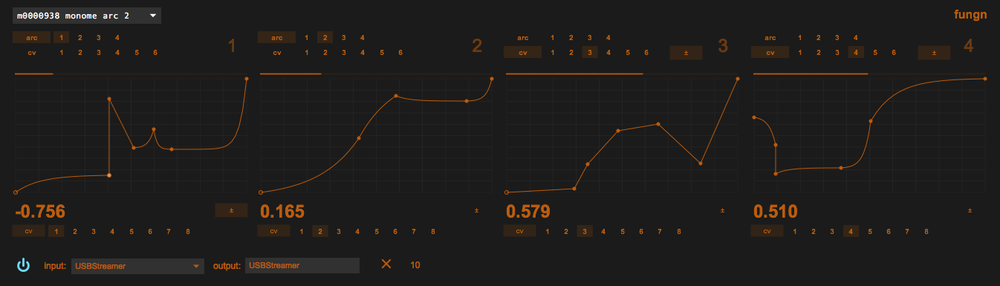

# fungnn

quad cv function generator

a simple utility inspired by many prior works in hardware and software

## notes

output of each function is displayed on corresponding arc ring

choose arc or cv as the input for a function, select the encoder or
channel as desired. functions can share inputs

choose a cv channel for output. deselecting cv mutes the function
output and holds the last value.

enabling ± on a cv input maps bipolar cv to unipolar function input

enabling ± on a cv output maps unipolar function output to bipolar cv
output
